# MIKHMON by NODERA (Desktop & Cloud Standalone Edition)

<p align="center">
  
</p>

<p align="center">
  <a href="https://panel.dgtlnetsolution.com/desktop-licenses"></a>
  <a href="https://panel.dgtlnetsolution.com"></a>
  <a href="https://panel.dgtlnetsolution.com/desktop-licenses"></a>
  <a href="https://panel.dgtlnetsolution.com"></a>
</p>

---

## Tentang MIKHMON by NODERA

**MIKHMON by NODERA** adalah generasi baru aplikasi manajemen hotspot dan billing MikroTik yang dikembangkan dan dioptimalkan secara modern oleh **NODERA Digital Network**. 

Berbeda dengan Mikhmon biasa (legacy v3/v4) yang hanya berfungsi sebagai antarmuka API dasar untuk cetak voucher, **MIKHMON by NODERA** dibangun menjadi ekosistem penjualan voucher yang lengkap dengan modul kasir warung, pembayaran QRIS otomatis, integrasi WhatsApp Gateway, notifikasi Telegram interaktif, serta runtime portable terisolasi tanpa memerlukan XAMPP atau instalasi web server eksternal.

---

## Perbandingan: MIKHMON by NODERA vs Mikhmon Biasa (Legacy v3/v4)

Berikut adalah tabel perbedaan mendasar antara **MIKHMON by NODERA** dengan versi Mikhmon umum di pasaran:

| Fitur / Parameter | Mikhmon Biasa (Legacy v3 / v4) | MIKHMON by NODERA (Desktop & VPS Standalone) |
| :--- | :--- | :--- |
| **Server & Runtime** | Butuh install Web Server / XAMPP manual | **Portable Micro-Server (PHP 8.2)** built-in, 1-klik jalan tanpa XAMPP |
| **Modul Warung POS** | Tidak ada | **Modul Kasir Warung & Agen Kulakan** lengkap dengan saldo deposit & cetak struk |
| **Payment Gateway QRIS** | Tidak ada / Perlu script pihak ketiga | **NODERA Pay Dynamic QRIS** otomatis generate voucher instan saat lunas |
| **WhatsApp Gateway** | Tidak ada | **Multi-Provider WA Gateway** otomatis kirim voucher langsung ke nomor WA pembeli |
| **Notifikasi Telegram** | Terbatas pada notif login teks biasa | **Telegram Bot Interaktif**: Notif login, rekap omset, tombol **Accept/Reject**, & **Alert Voucher Expired** |
| **Alert Voucher Expired** | Tidak ada | **Real-time Alert Voucher Kedaluwarsa** ke Telegram admin/teknisi |
| **Dukungan RouterOS** | Terbatas / Sering error pada RouterOS v7 | **Full Support RouterOS v6 & v7** dengan optimasi koneksi API cepat |
| **Cetak Struk Thermal** | Format kertas browser standar | **Direct Bluetooth & USB Thermal Print (58mm/80mm)** dengan format struk rapi |
| **Sistem Lisensi & Proteksi** | Gratisan / Tidak terkelola | **Cloud-Managed HWID License**: Reset HWID mandiri via Cloud Panel saat ganti PC |
| **Pembaruan & Ekosistem** | Proyek legacy (jarang update) | **Terhubung langsung dengan Cloud Panel NODERA** dan update fitur berkala |

---

## Fitur Unggulan MIKHMON by NODERA

### 1. Modul Kasir Warung POS & Reseller Kulakan
- Memungkinkan Anda menitipkan penjualan voucher ke warung, toko kelontong, atau reseller setempat.
- Antarmuka kasir warung yang sangat sederhana dan cepat diakses melalui HP atau laptop kasir.
- Sistem saldo deposit warung dengan perhitungan laba otomatis.
- Cetak struk penjualan langsung ke printer thermal kasir.

### 2. NODERA Pay Dynamic QRIS & Checkout Otomatis
- Pelanggan hotspot dapat membeli voucher secara mandiri melalui portal pembelian.
- Menampilkan QRIS dinamis real-time dengan nominal pas (bebas konfirmasi manual).
- Setelah pembayaran berhasil via GoPay, OVO, Dana, ShopeePay, BCA, atau Mobile Banking lainnya, sistem langsung membuat voucher di MikroTik dan menampilkannya di layar pembeli.

### 3. WhatsApp Gateway Multi-Provider
- Mengirimkan kode voucher, username, password, dan masa aktif langsung ke nomor WhatsApp pelanggan begitu transaksi selesai.
- Pengingat masa aktif voucher dan informasi gangguan jaringan broadcast ke pelanggan.

### 4. Telegram Interactive Bot & Expired Alert
- **Notifikasi Penjualan Real-time**: Laporan masuk setiap kali ada voucher terjual.
- **Alert Voucher Expired**: Notifikasi instan saat voucher pengguna habis masa aktifnya di MikroTik lengkap dengan username, profil, dan waktu kedaluwarsa.
- **Tombol Aksi Cepat**: Tombol *Accept* / *Reject* pesanan langsung dari jendela chat Telegram.
- **Laporan Harian**: Rekap omset dan statistik penjualan harian hotspot secara otomatis.

### 5. Thermal Printing Terstandarisasi
- Desain template voucher yang presisi untuk printer thermal ukuran **58mm** dan **80mm**.
- Mendukung cetak massal (batch print) dengan QR Code auto-login (*Scan to Connect*).
- Kustomisasi logo, watermark, dan catatan kaki (*footer*) voucher.

### 6. Multi-Router Architecture (ROS v6 & ROS v7)
- Kelola banyak router MikroTik cabang dari satu aplikasi desktop terpusat.
- Mendukung port API standar maupun port kustom dengan keamanan koneksi tinggi.
- Monitor traffic real-time, grafik interface, dan status DHCP Leases langsung dari dashboard.

### 7. Keamanan Lisensi & Manajemen HWID Mandiri
- Dilindungi sistem verifikasi Hardware ID (HWID) berbasis cloud dengan tanda tangan digital kriptografi.
- **Fitur Reset HWID Mandiri**: Jika Anda mengganti laptop atau komputer kasir, Anda dapat mereset ikatan HWID langsung dari Member Panel tanpa harus menghubungi admin.

---

## Preview Antarmuka Desktop (PC / Laptop View)

Tampilan antarmuka desktop **MIKHMON by NODERA** yang responsif, bersih, dan modern:

### 1. Dashboard Utama MikroTik & Telemetri (RouterOS v7)
<p align="center">
  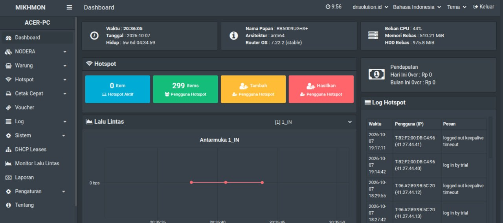
</p>
*Monitoring real-time RouterOS 7.22.2 arm64 (RB5009UG+S+): status CPU, RAM, Uptime, DHCP Leases, grafik traffic, dan log aktivitas trial user.*

### 2. Ekosistem Warung POS & Reseller Kulakan
| Manajemen Mitra Warung (Admin) | Dashboard Kasir Warung (Reseller) |
| :---: | :---: |
| 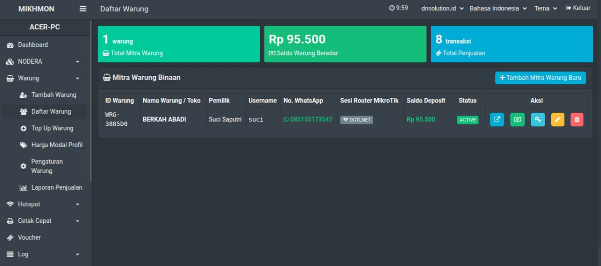 | 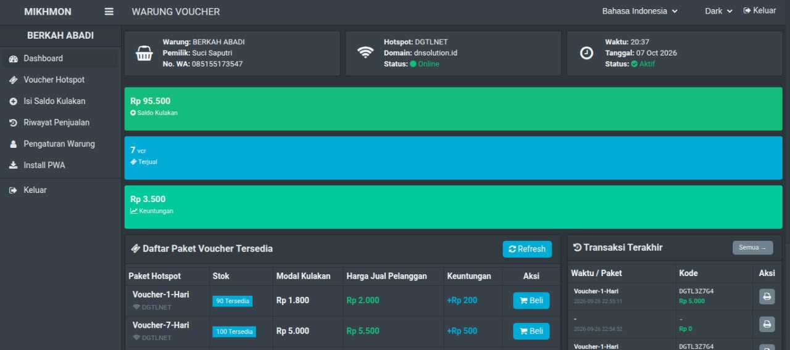 |
| *Daftar warung mitra, monitoring saldo beredar, & kontrol akun* | *Panel kasir warung, stok paket voucher, & riwayat penjualan* |

| Modal Checkout Voucher (Kasir) | Struk Penjualan & QR Code (Kasir) |
| :---: | :---: |
| 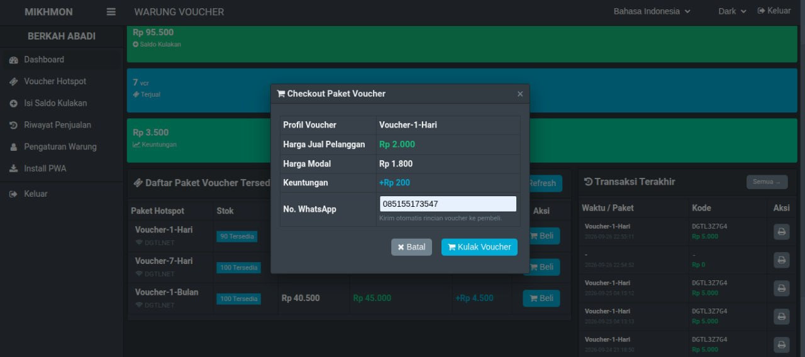 | 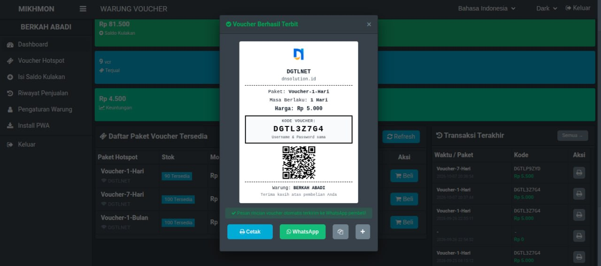 |
| *Rincian harga modal, harga jual, margin laba, & input WA pembeli* | *Struk instan dengan QR Code autologin, tombol cetak, & kirim WA* |

### 3. Integrasi Gateway Otomatisasi (WhatsApp & Telegram)
| WhatsApp Gateway Multi-Provider | Bot & Notifikasi Telegram Interaktif |
| :---: | :---: |
| 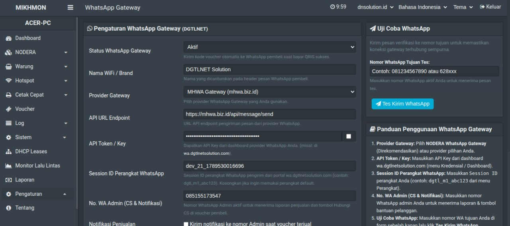 | 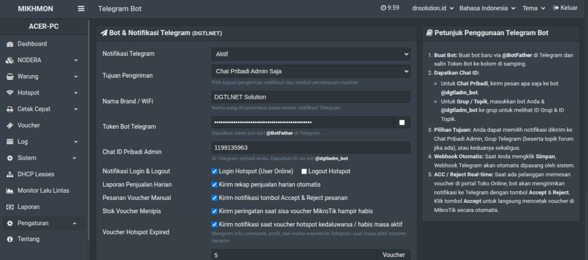 |
| *Konfigurasi endpoint, session ID, template pesan, & tes kirim* | *Alert voucher expired, rekap omset, order manual, & tombol respon* |

---

## Tangkapan Layar & Preview Fitur (Mobile Interface)

Berikut adalah beberapa tampilan antarmuka fitur utama **MIKHMON by NODERA** yang dioptimalkan untuk perangkat mobile dan desktop:

| Dashboard & Telemetri MikroTik | Navigasi Sidebar & Modul Warung POS |
| :---: | :---: |
| 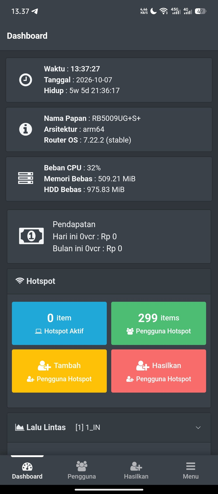 | 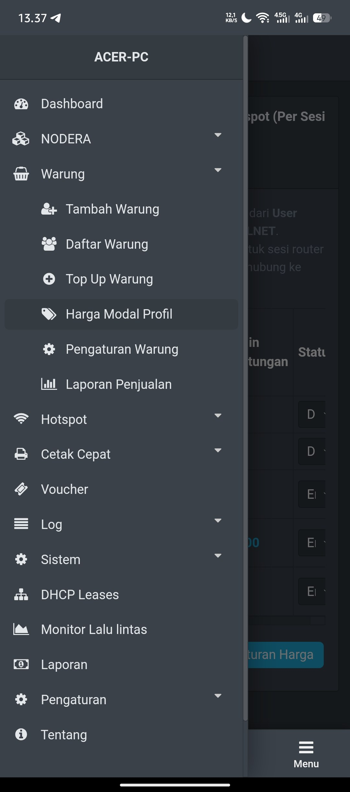 |
| *Status CPU, RAM, Uptime MikroTik & Statistik Hotspot* | *Menu lengkap terintegrasi Warung, Cetak Cepat, & Gateway* |

| Manajemen Mitra Warung & Saldo POS | Katalog Desain Template Voucher |
| :---: | :---: |
| 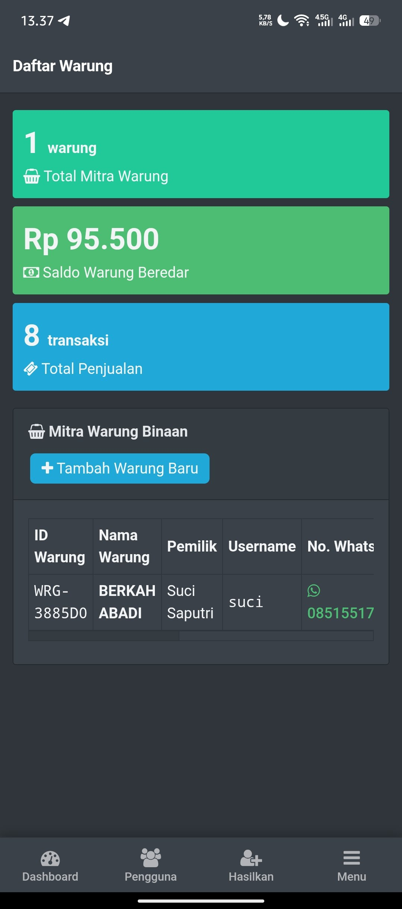 | 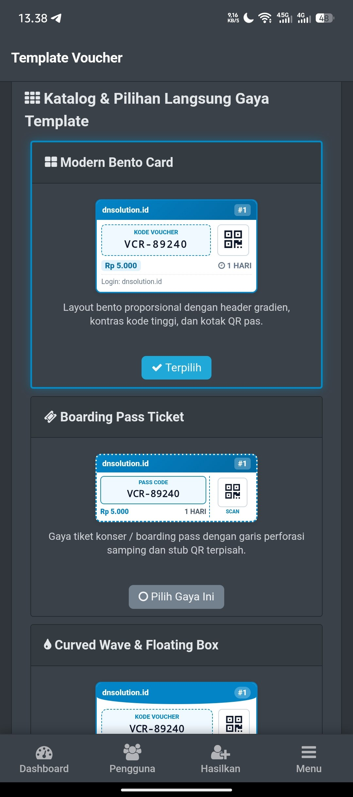 |
| *Daftar warung mitra, monitoring saldo deposit & mutasi transaksi* | *Pilihan layout voucher: Modern Bento, Boarding Pass, Curved Wave* |

| Pilihan Tema Toko Pembelian Online | NODERA Pay Dynamic QRIS Gateway |
| :---: | :---: |
| 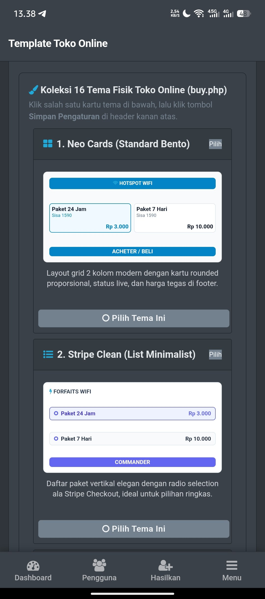 | 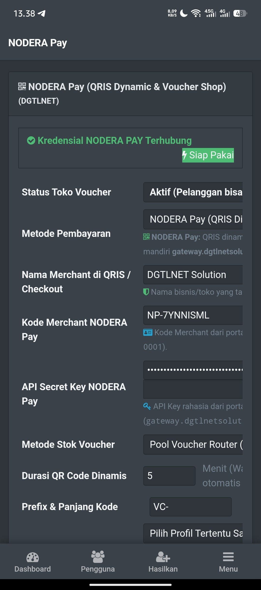 |
| *Pilihan layout halaman pembelian voucher mandiri oleh pelanggan* | *Pengaturan Dynamic QRIS, durasi bayar, & auto generate voucher* |

| Bot & Notifikasi Telegram Interaktif | Integrasi WhatsApp Gateway |
| :---: | :---: |
| 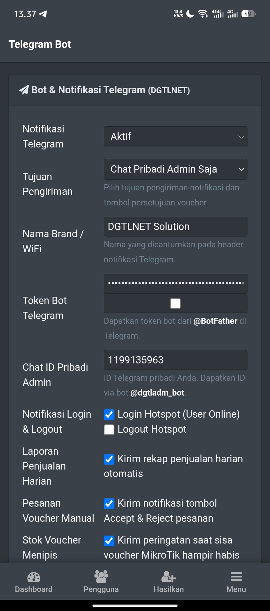 | 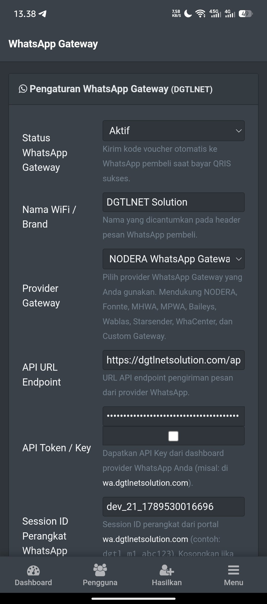 |
| *Notifikasi penjualan, alert voucher expired, & rekap omset harian* | *Kirim otomatis kode voucher & info login langsung ke WA pembeli* |

---

## Cara Instalasi & Penggunaan

### A. Instalasi di Windows 10 / 11 (Desktop Standalone)
1. **Unduh Paket Aplikasi**:
   - Download file ZIP installer resmi langsung dari GitHub: **[Download Mikhmon-Desktop.zip](https://github.com/fitratan/MIKHMON-by-NODERA/archive/refs/heads/main.zip)**
   - Atau clone repository: `git clone https://github.com/fitratan/MIKHMON-by-NODERA.git`
2. **Ekstrak File**:
   - Ekstrak seluruh isi file ZIP ke folder pilihan Anda di laptop/PC (rekomendasi: `C:\Mikhmon-Desktop` atau `D:\Mikhmon-Desktop`).
3. **Jalankan Aplikasi**:
   - Buka folder hasil ekstrak, lalu klik ganda pada file **`Start-Mikhmon.bat`**.
   - Aplikasi akan otomatis menyalakan server lokal dan membuka browser ke alamat `http://127.0.0.1:8080`.
4. **Login Pertama Kali**:
   - Masuk dengan kredensial default: Username `nodera`, Password `nodera`.
5. **Masa Percobaan 7 Hari Gratis (Auto Trial)**:
   - Setiap download baru otomatis mendapatkan **Free Trial 7 Hari** tanpa perlu memasukkan License Key di awal. Seluruh fitur sudah langsung terbuka penuh.

---

### B. Instalasi di Linux VPS / Cloud Server (Ubuntu, Debian, AlmaLinux)

Mikhmon by NODERA dapat di-deploy langsung di VPS Linux menggunakan Web Server (Nginx/Apache) ataupun PHP Standalone Server:

#### 1. Cara Web Server (Nginx / Apache / aaPanel):
```bash
# 1. Masuk ke direktori web root server
cd /var/www/html

# 2. Download dan ekstrak source code
wget https://github.com/fitratan/MIKHMON-by-NODERA/archive/refs/heads/main.zip
unzip main.zip
mv MIKHMON-by-NODERA-main mikhmon
rm main.zip

# 3. Atur izin akses direktori untuk penyimpanan konfigurasi router
chown -R www-data:www-data mikhmon
chmod -R 755 mikhmon
```
Akses melalui browser: `http://IP-VPS-ANDA/mikhmon/login`

#### 2. Cara Cepat Standalone (PHP Built-in Server):
```bash
# 1. Masuk folder mikhmon
cd /root/mikhmon

# 2. Jalankan background service pada port 8080
php -S 0.0.0.0:8080
```
Akses melalui browser: `http://IP-VPS-ANDA:8080/login`

---

## Kredensial Login Default

| Parameter | Nilai Default | Keterangan |
| :--- | :--- | :--- |
| **URL Aplikasi** | `http://127.0.0.1:8080` | Port lokal built-in PHP 8.2 |
| **Username** | `nodera` | Akun administrator utama |
| **Password** | `nodera` | Kata sandi default pertama kali |

---

## Pembelian Lisensi Resmi & Informasi Kontak

Lisensi resmi **Mikhmon Desktop Standalone** dapat dibeli dan dikelola secara mandiri melalui:

- **Portal Pembelian Lisensi**: [panel.dgtlnetsolution.com](https://panel.dgtlnetsolution.com)
- **Telegram**: [@nullneko_exe](https://t.me/nullneko_exe)

### Keuntungan Memiliki Lisensi Resmi:
- Masa aktif lisensi fleksibel (Bulanan / Tahunan / Selamanya).
- Dashboard kontrol lisensi untuk memantau status perangkat dan masa berlaku.
- Akses penuh ke seluruh fitur Warung POS, WhatsApp Gateway, Telegram Bot, dan Payment Gateway.
- Dukungan teknis dan update pembaruan sistem dari tim NODERA.

---

## Persyaratan Sistem (System Requirements)

- **Sistem Operasi**: Windows 10 / Windows 11 (64-Bit) atau Linux Server
- **Prosesor**: Dual Core 1.5 GHz atau lebih tinggi
- **RAM**: Minimal 2 GB (Rekomendasi 4 GB)
- **Penyimpanan**: Minimal 500 MB ruang kosong
- **Koneksi Internet**: Diperlukan saat aktivasi awal lisensi dan sinkronisasi gateway

---

<p align="center">
  <b>NODERA</b><br>
  Digital Network Solution<br>
  <i>Copyright &copy; 2026 NODERA. All Rights Reserved.</i>
</p>
